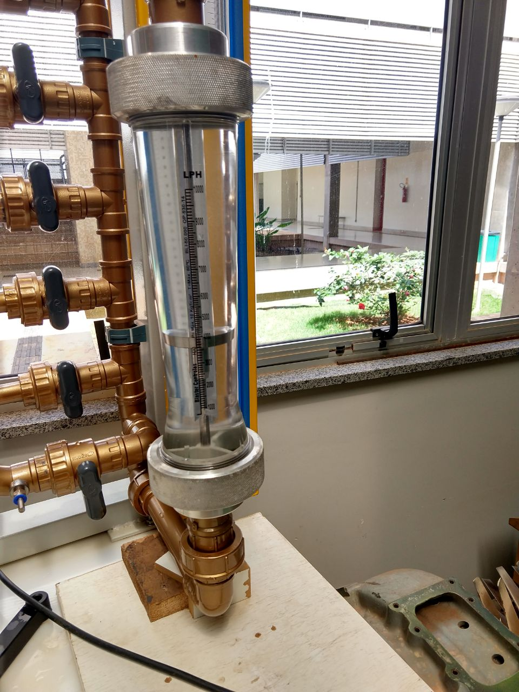
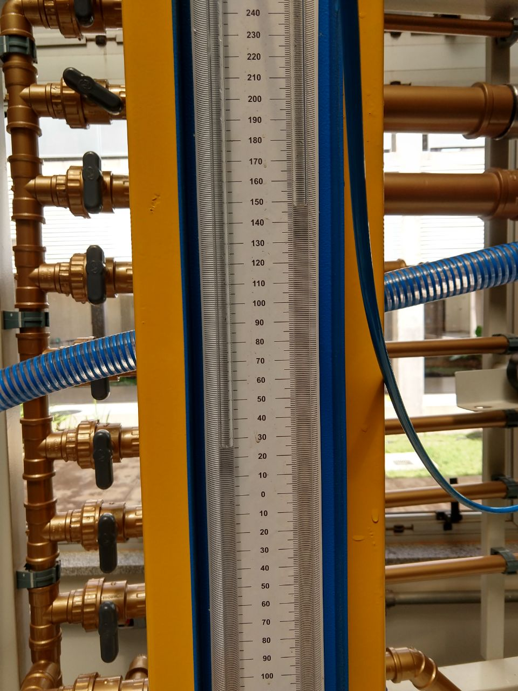
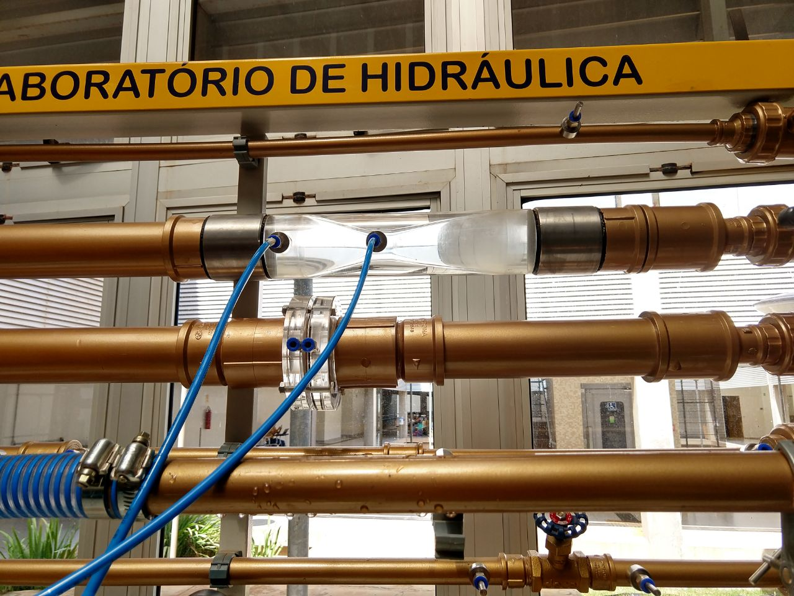
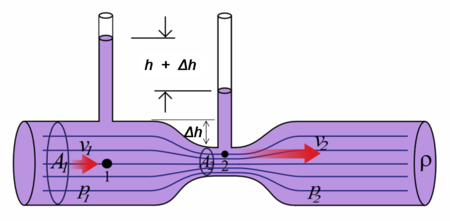
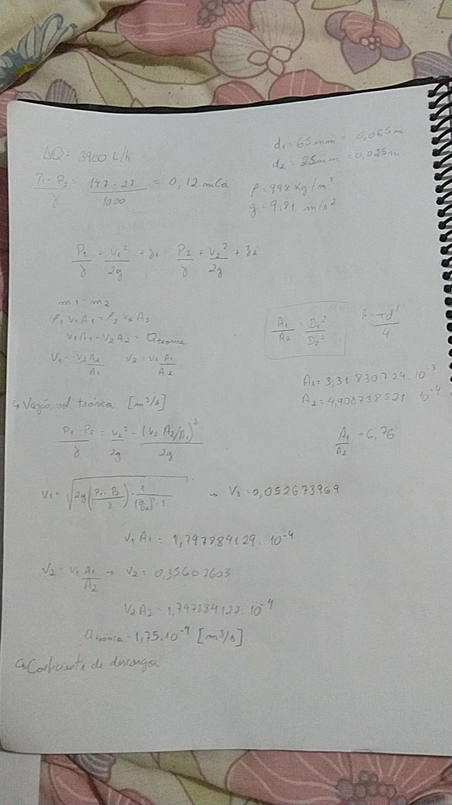
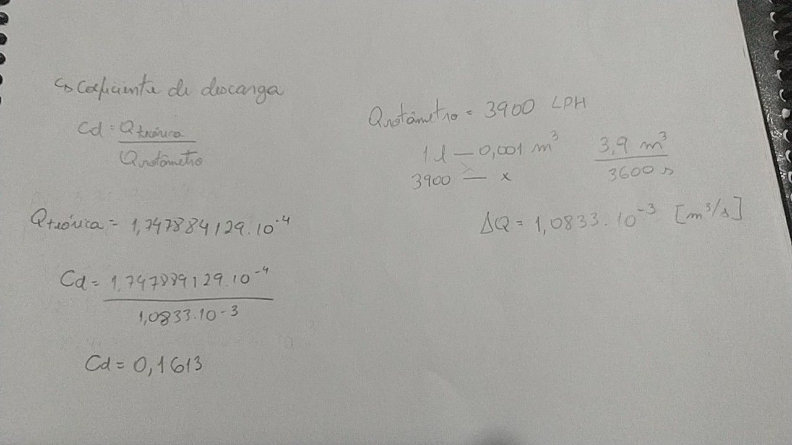

# Relatório do Grupo 10: #

  - Thainá Rodrigues Fernandes - 14/0051724
  - Danyllo Wenceslau - 16/0117364
  - Giulliano Cezar - 13/0027260

### 1.	Início: ###

Os temas disponíveis são:

-	Linhas de trajetória de um escoamento fluido
-	Linhas de emissão de um escoamento fluido
-	Vorticidade
-	Efeito Magnus
-	Efeito de Bernoulli
- Tubo Venturi
-	Placa de Orifício
-	Perda de Carga
-	Controle de Camada Limite
-	Turbulência em Fluidos
-	Experimentos em túnel de vento

O relatório desta etapa deverá ser feito no arquivo destinado a cada grupo neste repositório até o **dia 19/08/2018**, contendo os seguintes tópicos:

### Nota da etapa: 2,5 ###

-	Integrantes do grupo;
  - Thainá Rodrigues Fernandes - 14/0051724
  - Danyllo Wenceslau - 16/0117364
  - Giulliano Cezar - 13/0027260
  
-	Tema escolhido;
    Tubo Venturi
 
-	Objetivo do experimento – O que será medido ou determinado no experimento;
    Demonstrar do princípio de Bernoulli no Tubo Venturi

-	Escopo do experimento – Estabelecimento de tarefas mínimas para cumprir os objetivos do experimento;
    Como no primeiro momento temos um conhecimento limitados dos equipmentos disponíveis no laboratório da FGA, a primeira etapa do procedimento é verificar os equipamentos disponíveis para analisar as condições do experimento e a necessidade de uso de recursos adicionais; e assim elaborar o procedimento do experimento. De qualquer forma, independemente dos equipamentos usados, uma típica demonstração do princípio de Bernoulli se dá da seguinte forma: Indução de um fluido específico pelo sistema conhecido como "Tubo Venturi" de forma a analisar as diferenças de pressão entre as áreas transversais e a vazão, aplicando assim o princípio de Bernoulli. 
    No experimento as etapas básicas são: ajustar o escoamento para o fluxo desejado; medir a vazão no tubo de Venturi, analisando a pressão; realizar os cálculos necessários e comparar os resultados teóricos com os experimentais.

### 2.	Planejamento e Preparação: ###

### Nota da etapa: 2,5 ###

- Identificação do grupo;
  - Thainá Rodrigues Fernandes - 14/0051724
  - Danyllo Wenceslau - 16/0117364
  - Giulliano Cezar - 13/0027260
  
- Teoria do experimento;

  O princípio de Bernoulli descreve a conservação de energia por unidade de massa de um fluido em movimento e suas aplicações são   diversas na engenharia. Para usar esse princípio é preciso considerar três condições na análise do escoamento: o escoamento deve obedecer um regime permanente, deve ser incompressível e as forças de viscosidade devem ser desprezíveis. Esse princípio pode ser usado, por exemplo, para quantificar velocidades de escoamentos estacionários de descarga de reservatórios, para estimar velocidades de um fluido em um tubo com restrições geométricas e para projetar asas de aviões. 

  Tendo como base a lei de conservação de energia, o princípio de Bernuolli consiste na formulação matemática referente à descrição do movimento de um fluido ideal em um escoamento. Sendo apresentado como:
  
  (V²/2) + (P/rô) + g.h = cte, onde
  - V = velocidade do fluido
  - P = Pressão do fluido
  - rô = Massa específica do fluido
  - g = gravidade
  - h = altura
  
  A demonstração do princípio de Bernoulli neste experimento utilizará um tubo de venturi, que possibilita a medição da velocidade do escoamento e vazão do líquido dentro do tubo através da diferença de pressão causada pela variação geométrica do aparato. Dessa forma, a aplicação do teorema de Bernoulli em trechos diferentes do sistema, deverá retornar valores que comprovem que há um continuidade de massa, ou seja, em todos os pontos do tubo, a pressão e a velocidade do fluido se ajustam de forma a retornar uma mesma taxa de vazão.

- Procedimentos experimentais

    - Estimativa do tempo necessário para a montagem e execução do procedimento;
    
      É estimado que seja possível realizar o experimento em sua totalidade no laboratório da FGA, em uma visita de em média 1h30min. Caso haja necessidade, devido a falta de algum dado, ou qualquer outro imprevisto, fica reservado uma data no cronograma para uma eventual segunda visita ao laboratório, mas o esperado é que a mesma não seja necessária.
    
    - Membro do grupo responsável pelo procedimento de montagem e execução;
    
      O procedimento de montagem é simples, pois será utilizada a bancada do  laboratório. Para a execução do experimento todos os membros estarão presentes.
    
    - Cronograma estimado para a montagem e realização do experimento completo;
    
      |      Dia      	|                                       Atividade                                       	|
      |:-------------:	|:-------------------------------------------------------------------------------------:	|
      | 27/08 - 20/09 	| Elaboração da parte teórica                                                           	|
      |     21/09     	| Visita ao laboratório para a parte prática                                            	|
      | 22/09 - 21/10 	| Realização dos cálculos da parte experimental                                         	|
      |     26/10     	| Data reservada para a eventualidade de ser necessária outra visita ao laboratório     	|
      | 27/10 - 04/11 	| Elaboração e entrega da parte 3 do relatório                                          	|
      | 05/11 - 08/11 	| Documentar os dados obtidos                                                           	|
      | 09/11 - 13/11 	| Realizar a análise dos resultados (comparação com a teoria e gráficos, se necessário) 	|
      |     14/11     	| Conclusões do experimento                                                             	|
      | 15/11 - 18/11 	| Elaboração e entrega da parte 4 do relatório                                          	|
    
- Determinação dos dados a serem medidos e/ou calculados;

  Medidos

  - Velocidade do fluido na “garganta” do Tubo Venturi
  - Vazão (por meio do rotâmetro)

  Calculados

  - Coeficiente de descarga
  
 - Resultados esperados;
 
    Como resultado, esperamos que os valores obtidos no experimento sejam coerentes, em sua totalidade, com a formulação teórica (Bernoulli), comprovando assim, todas as relações entre as variáveis da equação.

### 3.	Execução: ###

- Integrantes do grupo;
  - Thainá Rodrigues Fernandes - 14/0051724
  - Danyllo Wenceslau - 16/0117364
  - Giulliano Cezar - 13/0027260
  
- Divisão de tarefas:

  Para a execução do experimento todos os membros estiveram presentes.
  
- Fotos do experimento montado;
  
    
    
    
    
    
    
    A demonstração do princípio de Bernoulli neste experimento utilizará um tubo de venturi, que possibilita a medição da velocidade do escoamento e vazão do líquido dentro do tubo através da diferença de pressão causada pela variação geométrica do aparato. Dessa forma, a aplicação do teorema de Bernoulli em trechos diferentes do sistema, deverá retornar valores que comprovem que há um continuidade de massa, ou seja, em todos os pontos do tubo, a pressão e a velocidade do fluido se ajustam de forma a retornar uma mesma taxa de vazão.
     
     Para calcular o coeficiente de descarga é necessário calcular a vazão volumétrica teórica. O que pode ser feito por meio da equação de Bernoulli. 
     
    A partir desta, a velocidade do fluido pode ser encontrada, no tubo (ponto 1) e na garganta (ponto 2).

    

    A velocidade no ponto 1 multiplicada pela área do tubo nesse ponto é igual a velocidade no ponto 2 multiplicada pela área da garganta. Esse valor é a vazão volumétrica teórica.

    O coeficiente de descarga é a razão entre a vazão teórica e a vazão do rotâmetro, que foi medida experimentalmente.
     
    
    
    

## 4.	Análise e conclusão: ##

O relatório desta etapa deverá ser feito no arquivo destinado a cada grupo neste repositório até o **dia 18/11/2018**, contendo os seguintes tópicos:

- Integrantes do grupo
  - Thainá Rodrigues Fernandes - 14/0051724
  - Danyllo Wenceslau - 16/0117364
  - Giulliano Cezar - 13/0027260
  
- #### _Resultados_

    | Medição 	| Vazão (LPH) 	| \Delta P (mCa) 	|
    |:-------:	|:-----------:	|:--------------:	|
    |    1    	|     3400    	|      0,83      	|
    |    2    	|     3500    	|      0,84      	|
    |    3    	|     3300    	|      0,79      	|
    |  média  	|     3400    	|      0,82      	|
    
    
    
    Pela equação da continuidade
    
    
    
    
    
    Pela equação de Bernoulli
    
    
    
    Aplicando continuidade
    
    
    
    Encontrando as áreas
    
    
    
    Coeficiente de descarga
    
    
 
-	Conclusões do experimento;

    Como dito anteriormente, neste experimento utilizou-se um tubo de venturi, que possibilita a medição da velocidade do escoamento e vazão do líquido dentro do tubo através da diferença de pressão causada pela variação geométrica do aparato. Dessa forma, a aplicação do teorema de Bernoulli em trechos diferentes do sistema, deve retornar valores que comprovem que há um continuidade de massa, ou seja, em todos os pontos do tubo, a pressão e a velocidade do fluido se ajustam de forma a retornar uma mesma taxa de vazão.
    
    O resultado obtido para o coeficiente de descarga foi 1,002128. Um resultado muito próximo do previsto na literatura, o que pode ser explicado pelo fato do experimento ter sido realizado de forma eficaz. É possível concluir que quanto maior o coeficiente de descarga, menores são os erros relativos. 
