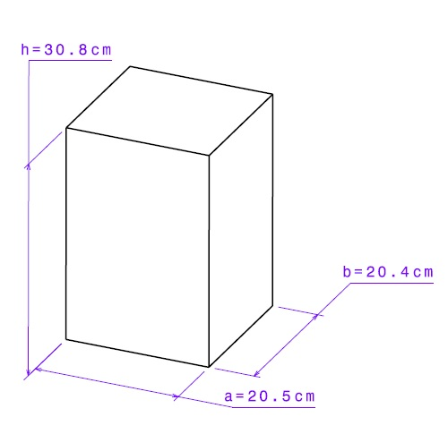
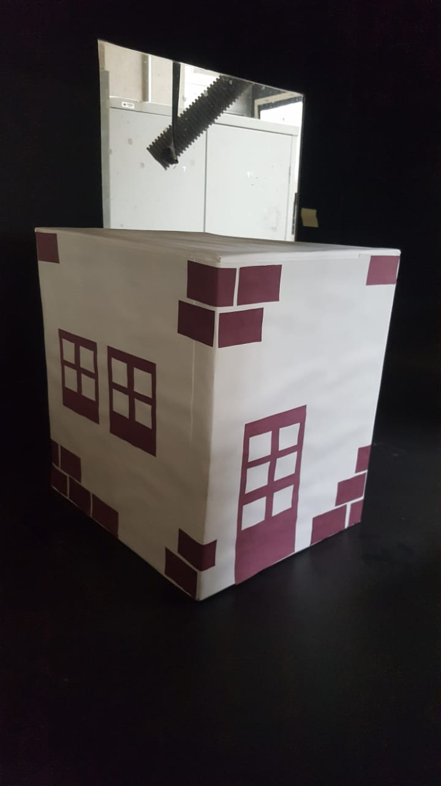
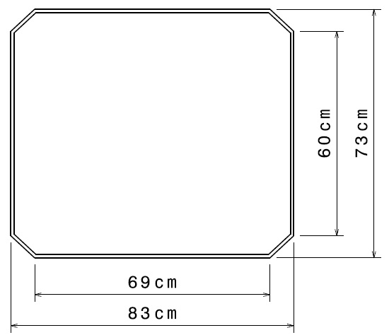
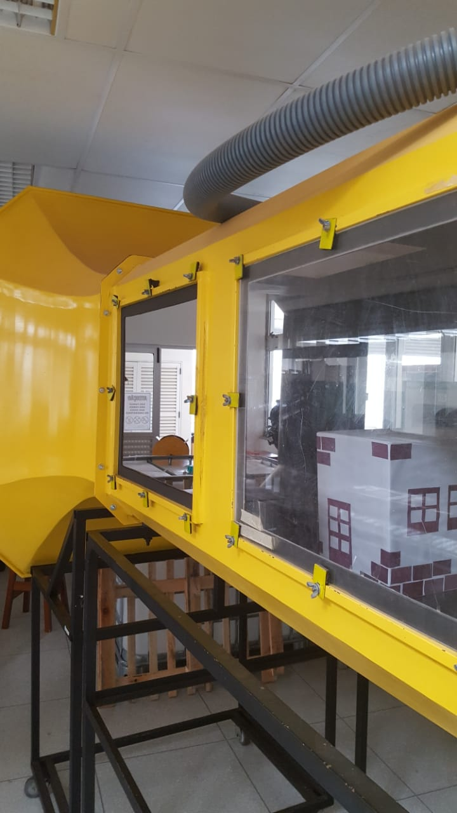
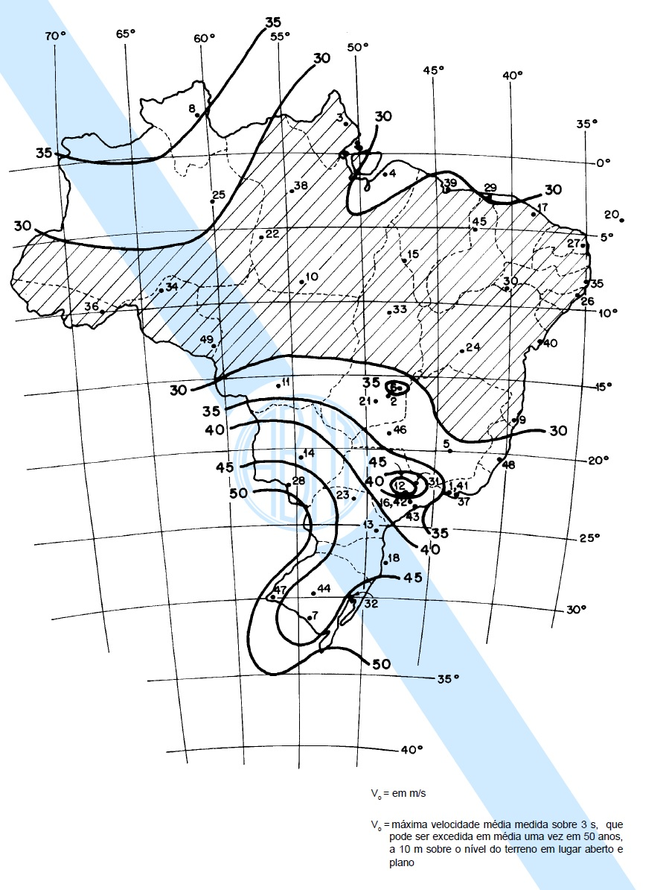
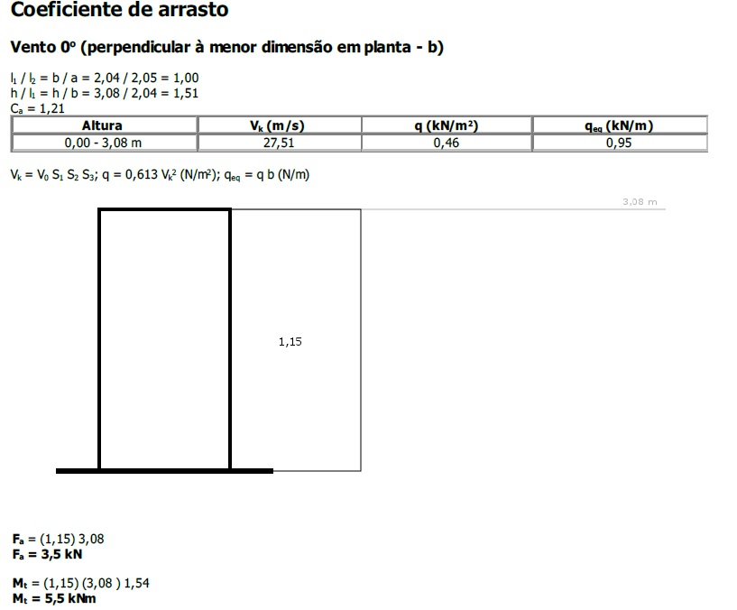
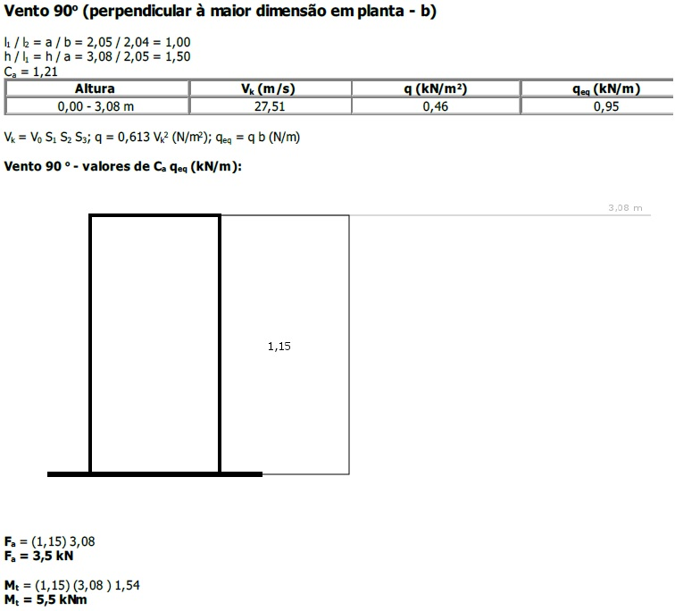

# Relatório do Grupo 2: #

  - Richard da Silva Francisco de Souza - 14/0091793
  - Luyza Lorenna L. Lopes - 16/0135133
  - Matheus de Avila Mariano - 16/0137896

### 1.	Início: ###

Os temas disponíveis são:

-	Linhas de trajetória de um escoamento fluido
-	Linhas de emissão de um escoamento fluido
-	Vorticidade
-	Efeito Magnus
-	Efeito de Bernoulli
- Tubo Venturi
-	Placa de Orifício
-	Perda de Carga
-	Controle de Camada Limite
-	Turbulência em Fluidos
-	Experimentos em túnel de vento

O relatório desta etapa deverá ser feito no arquivo destinado a cada grupo neste repositório até o **dia 19/08/2018**, contendo os seguintes tópicos:

-	Integrantes do grupo;
-	Tema escolhido;
-	Objetivo do experimento – O que será medido ou determinado no experimento;
-	Escopo do experimento – Estabelecimento de tarefas mínimas para cumprir os objetivos do experimento;

### 2.	Planejamento e Preparação: ###

O relatório desta etapa deverá ser feito no arquivo destinado a cada grupo neste repositório até o **dia 26/08/2018**, contendo os seguintes tópicos:

- Identificação do grupo;
- Teoria do experimento;
- Procedimentos experimentais, onde as seguintes informações deverão ser colocadas:
    - Estimativa do tempo necessário para a montagem e execução do procedimento;
    - Membro do grupo responsável pelo procedimento de montagem e execução;
    - Cronograma estimado para a montagem e realização do experimento completo;
- Determinação dos dados a serem medidos e/ou calculados;
- Resultados esperados;

### 3.	Execução: ###

O relatório desta etapa deverá ser feito no arquivo destinado a cada grupo neste repositório até o **dia 04/11/2018**, contendo os seguintes tópicos:

- Integrantes do grupo;
- Divisão de tarefas, conforme descrito na etapa 2. Se houver mudança em relação à etapa 2, uma justificativa deverá ser apresentada;
- Descrição dos procedimentos realizados, onde deverão ser apresentados:
  - Fotos do experimento montado;
  - Descrição de cada procedimento executado e justificativa, se houver diferença com a etapa 2;
  - Dados medidos;

### 4.	Análise e conclusão: ###

O relatório desta etapa deverá ser feito no arquivo destinado a cada grupo neste repositório até o **dia 18/11/2018**, contendo os seguintes tópicos:

-	Integrantes do grupo;
-	Apresentação dos dados medidos no experimento com seu respectivo erro experimental;
-	Apresentação de gráficos e sua respectiva análise;
-	Comparação dos resultados com a teoria envolvida;
-	Conclusões do experimento;

## Relatório 01 - Grupo 02

### Nota da etapa: 2,5 ###

### Integrantes
- Richard da Silva Francisco de Souza - 14/0091793
- Luyza Lorenna L. Lopes - 16/0135133
- Matheus de Avila Mariano - 16/0137896

### Tema

Experimentos em túnel de vento

### Objetivo do experimento

Medir o coeficiente de arrasto de um objeto(à determinar).

### Escopo do experimento

- Levantamento da teoria necessária para a realização do experimento;
- Levantamento de dados e variáveis necessários para o cálculo;
- Levantamento das forças devidas as ações estática e dinâmica do vento;
- Escolha do objeto a ser analisado no experimento em questão;
- Realização do experimento em si, com o túnel de vento do Laboratório de Termofluidos da FGA.

## Relatório 02 - Grupo 02

### Nota da etapa: 2,5 ###

### Integrantes
- Richad S. F. de Souza - 14/0091793
- Luyza Lorenna L. Lopes - 16/0135133
- Matheus de Avila Mariano - 16/0137896

### Teoria do Experimento
As estruturas, em um escoamento de um fluido, sofrem ação da resistência aerodinâmica conhecida como Coeficientes de Arrasto ou de Pressão. De acordo com White (1991), um corpo de forma arbitrária, quando imerso em um fluido a escoar, fica exposto a forças e momentos, em três direções (força de arrasto, força transversal e força lateral).
Como neste experimento utilizaremos escoamentos de baixas velocidades, a relação entre o número de Reynolds e o Coeficiente de Arrasto será suficiente para fazer uma modelagem confiável nas situações em escala real.
Essa modelagem é possível pois o Coeficiente de Arrasto é função exclusiva do Número de Reynolds.

- : Massa específica do fluido;
- D: Longitude Característica do fluxo, o diâmetro para o fluxo no tubo;
- : Viscosidade dinâmica do Fluido; 
- : Velocidade Média do Fluido.

*Força de Arrasto*
É a força que surge sobre um corpo quando este é submetido ao escoamento de um fluido. Esta força é comprovada experimentalmente no ensaio em túnel de vento.

Para a determinação do Coeficiente de Arrasto, há de se conhecer algumas das variáveis a seguir, tabeladas na NBR6123/1988:

- Velocidade Básica do Vento,, do local. Para isso, utilizar-se-á a Isopletas dada Velocidade Básica;
- Velocidade Característica,, que é a Velocidade Básica multiplicada pelos Fatores ; 

   - Coeficientes de Pressão, ;
   - Coeficiente de Forma, F;
   - Coeficiente de Força, , que engloba a força de arrasto.

-  : Coeficiente de arrasto;
-  : Área frontal efetivada

Como ferramenta adicional, utilizar-se-á o software  gratuito CICLONE para auxílio da obtenção do coeficiente de arrasto e pressão.

### Procedimentos Experimentais

#### Procedimento 1: Escolha e fabricação do corpo de prova ####
- Estimativa de tempo: 10 dias úteis
   - Responsável:Richard

#### Procedimento 2: Ensaio do corpo de prova no túnel de vento ####
- Estimativa de tempo: 11 dias úteis
    - Montagem:(o túnel de vento já está montado. O tempo seria mais utilizado para regulagem do túnel de vento às necessidades do experimento)
    - Execução:3 dias( no caso três sextas-feiras 14/09,21/09 e 28/09)
- Responsável:Todos

#### Procedimento 3: Análise e estudo dos resultados ####
- Estimativa de tempo:14 dias úteis
    - Responsável:Todos

#### Cronograma de atividades ####
- Escolha e fabricação dos corpos de prova(27/08 a 10/09);
- Ensaio do corpo de prova no túnel de vento(14/09 a 28/09);
- Análise e estudo dos resultados (01/10 a 19/10);
- Revisão do trabalho(20/10 a 28/10);

### Determinação de dados
- A determinação de dados será embasada na norma NBR6123/1988 - Forças devido ao vento em edificações;
Ou seja:

- Velocidade básica do vento,;

- Velocidade caraacterística,;

- ;

- Pressão dinâmica: 
    - 
    
- Coeficientes de pressão:
    - ;
    -  ,pressão efetiva externa e pressão efetivia interna, respectivamente;
- Coeficientes de forma;
- Coeficientes de Força;
- Número de Reynolds;
- Coeficiente de arrasto;

### Resultados esperados
- Espera se um resultado do tipo:

    - 

OBS.:Como ainda não possuimos medidas do túnel de vento, não foi possível elaborar um modelo de corpo de prova e assim um valor de coeficiente de arrasto esperado.O material do corpo de prova será MDF(Medium Density Fiberboard). 

## Relatório 03-Grupo 02

### Integrantes
- Richad S. F. de Souza - 14/0091793
- Luyza Lorenna L. Lopes - 16/0135133
- Matheus de Avila Mariano - 16/0137896

#### Procedimento 1: Escolha e fabricação do corpo de prova ####

-Responsável:Richard

O corpo de prova escolhido teria de ser compatível para que fosse possível analisar o coeficiente de arrasto em edificações.De forma bem simplória, o corpo de prova foi fabricado em formato de paralelepípedo simulando uma edificação simples.As medidas da referida maquete estão discriminadas imediatamente abaixo.

Figura 01-Dimensões do corpo de prova

Figura 02-Corpo de prova

#### Procedimento 2: Ensaio do corpo de prova no túnel de vento ####

-Responsável:Todos

  Na primeira parte desta etapa, está contemplado a coleta de dados do túnel de vento, tais como área de seção transversal , velocidade de entrada e velocidade de saída.Para aferir a seção transversal, foi utilizado uma trena e para as velocidades, um anemômetro disponibilizado no laboratório.Os resultados das velocidades obtidas estão discriminados na tabela, e as dimensões da seção transversal na figura abaixo.

Figura 03-Seção transversal

  Na segunda parte desta etapa, o corpo de prova fabricado foi levado ao túnel de vento e lá foram feitas aferições das velocidades de entrada e saída.

Figura 04-Túnel de vento

  Além de aferir as velocidades, nesta etapa foi preciso analisar como calcular a força que atuando no corpo de prova devido ao escoamento,dado extremamente necessário para o cálculo do coeficiente de arrasto.Para tanto, foi utilizado como auxílio o software Ciclone v 5.0.1.beta, tendo como base a norma “NBR-6123-Forças devido ao vento em edificações”.Feitas as devidas simulações,foi possível validar os dados obtidos experimentalmente,com o modelo da simulação.
  
  Assim, a partir da norma alguns dados de entrada para o cálculo do coeficiente de arrasto, tais como velocidade básica do vento, velocidade característica,pressão dinâmica,fatores , e  .A velocidade básica do vento, é a velocidade local.Este dado é retirado do gráfico de isopletas de velocidade disposto na norma.Na região do Distrito Federal, a velocidade básica adotada foi de 32 m/s.

Figura 05-Isopletas de velocidades.(Fonte:NBR-6123/1988)

  De acordo com a norma, o fator  está relacionado com a topografia do terreno.O valor adotado será  =1, que está relacionado a terrenos planos ou fracamente acidentados.
  Já o fator  está ligado à rugosidade do terreno,dimensões da edificação e altura sobre o terreno.Esse valor é calculado pela seguinte equação:

Onde:
- b:lado menor,a menor dimensão horizontal de uma edificação;
- p:expoente da lei potencial de variação de ;
- z:cota acima do terreno;e
- Fr:Fator de rajada.
  Os valores de b,p e Fr podem ser facilmente encontrados na tabela de Parâmetros meteorológicos e pela tabela de fator s2, disposta imediatamente abaixo.
 
 Figura 06-Tabela de Parâmetros Meteorólogicos.(Fonte:NBR-6123/1988)
 
 
 
 Figura 07-Tabela de Fator .(Fonte:NBR-6123/1988)
 
 ](fators2.jpg)
 
O fator  , por sua vez está diretamente relacionado à conceitos estáticos, e leva em consideração o grau de segurança requerido além da vida útil da edificação.O fator  , também é retirado de uma tabela de valores mínimos do fator  .

Figura 08-Valores mínimos do fator .(Fonte:NBR-6123/1988)

](fators3.jpg)

O valor de  utilizado neste experimento se enquadra no Grupo 3-Edificações e instalações industriais com baixo fator de
3 ocupação (depósitos, silos, construções rurais, etc.).
  A partir destes dados, foi possível calcular o a velocidade característica Vk e ,subsequentemente a pressão dinâmica(q) tanto para o vento incidindo na face maior  (20,4cm x 30,8cm) quanto na face menor (20,5cm x 30,8cm).Por questões de compatibilidade com o software Ciclone, as dimensões foram multiplicadas por um fator 10 e convertidas para a unidade padrão "metro".Depois de inseridos os valores no programa, os dados obtidos para o coeficiente atrito de pressão estão disponibilizados logo abaixo.
  
  
  Figura 09-Coeficiente de arrasto para vento a 0°.(Fonte:NBR-6123/1988)
  

Figura 10-Coeficiente de arrasto para vento a 90°.(Fonte:NBR-6123/1988)

Além das velocidades aferidas,da área medida, foi possível tambem visualisar brevemente as linhas de corrente , afim de poder identificar características do escoamento.Para isso, foi utilizado incenso para que fosse possível tal visualização.O resultado desta etapa do procedimento foi filmada e está disponibilizada para download logo abaixo.

[Linhas de Corrente-gif 1](tv4m.mp4)

[Linhas de Corrente-gif 2](gif1.mp4)

[Linhas de Corrente-gif 3](gif2.mp4)

[Linhas de Corrente-vídeo](video.mp4)

Foi necessário mudança do corpo de prova e do túnel de vento, para se conseguir observar as linhas de corrente, apesar disso, se considerarmos apenas como estudo, estas mudanças não afetarão nossa demonstração, guardada as devidas proporções.  Os efeitos da compressibilidade do vento em nossa simulação podem ser desprezados, pois a velocidade do vento não é alta o suficiente, apesar disso, pode-se observar a perda de pressão com a direção axial do escoamento. De acordo com a literatura, o Número de Reynolds é o parâmetro adimensional, combinando um comprimento de escala, uma velocidade de escala e uma viscosidade cinemática para o Escoamento Laminar Turbulento. As linhas de corrente são importantes pois a curvatura nos dá a indicação sore a aceleração e por isso sobre as forças que atuam sobre o fluido.

#### Procedimento 3: Análise e estudo dos resultados ####

-Responsável:Todos
Este procedimento foi realizado junto com os procedimentos anteriores, e a partir disso foi analisado a validade dos resultados e a necessidade de refazer ou não o experimento.

## Relatório 04-Grupo 02

### Integrantes
- Richad S. F. de Souza - 14/0091793
- Luyza Lorenna L. Lopes - 16/0135133
- Matheus de Avila Mariano - 16/0137896

Como dito anteriormente, para poder calcular o coeficiente arrasto para o corpo de prova foi necessário a obtenção de algumas medidas dentre elas a velocidade, área do corpo e área da seção transversal do túnel de vento para calibrar corretamente o anemômetro.Como o estudo que está sendo feito baseia se principalmente na NBR-6123/1988, boa parte dos parâmetros foram tirados das tabelas da norma tais como a velocidade básica do vento, os parâmetros , e.
Para os parâmetros , e, foi obtido os seguintes resultados através da consultas nas respectivas tabelas dispostas na parte 3 deste estudo.Assim:
### REFERÊNCIAS BIBLIOGRÁFICAS

-ASSOCIAÇÃO BRASILEIRA DE NORMAS TÉCNICAS.NBR 6123:Forças devidas ao vento em edificações.Rio de Janeiro,66p.1988. 

-FOX, Robert; MCDONALD, Alan; PRITCHARD, Philip. Introdução à mecânica dos fluidos. 8 ed. São Paulo: LTC, 2014. 884 p.
